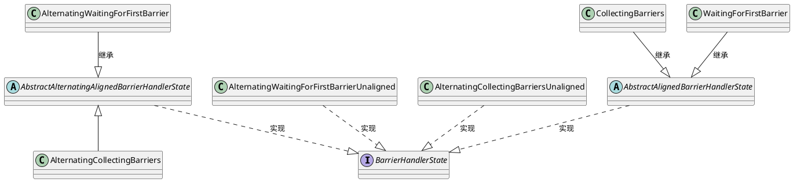

对齐模式，首次WaitingForFirstBarrier，之后转换为CollectingBarriers

非对齐，
1. 首次是AlternatingWaitingForFirstBarrier  直接调用alignmentTimeout，使用AlternatingWaitingForFirstBarrierUnaligned处理
2. 之后转换AlternatingCollectingBarriers，AlternatingCollectingBarriers实际是AlternatingCollectingBarriersUnaligned
3. AlternatingWaitingForFirstBarrierUnaligned会缓存数据
4. AlternatingCollectingBarriersUnaligned只关注有没有对齐
```
//AlternatingWaitingForFirstBarrier
if (checkpointBarrier.getCheckpointOptions().isUnalignedCheckpoint()) {
    BarrierHandlerState unalignedState = alignmentTimeout(controller, checkpointBarrier);
    return unalignedState.barrierReceived(
            controller, channelInfo, checkpointBarrier, markChannelBlocked);
}
public BarrierHandlerState alignmentTimeout(
        Controller controller, CheckpointBarrier checkpointBarrier)
        throws IOException, CheckpointException {
    state.prioritizeAllAnnouncements();
    return new AlternatingWaitingForFirstBarrierUnaligned(true, state);
}

protected BarrierHandlerState transitionAfterBarrierReceived(ChannelState state) {
    return new AlternatingCollectingBarriers(state);
}
//AlternatingCollectingBarriers
public BarrierHandlerState alignmentTimeout(
      Controller controller, CheckpointBarrier checkpointBarrier)
      throws IOException, CheckpointException {
  state.prioritizeAllAnnouncements();
  CheckpointBarrier unalignedBarrier = checkpointBarrier.asUnaligned();
  controller.initInputsCheckpoint(unalignedBarrier);
  for (CheckpointableInput input : state.getInputs()) {
      input.checkpointStarted(unalignedBarrier);
  }
  controller.triggerGlobalCheckpoint(unalignedBarrier);
  return new AlternatingCollectingBarriersUnaligned(true, state);
}
```
