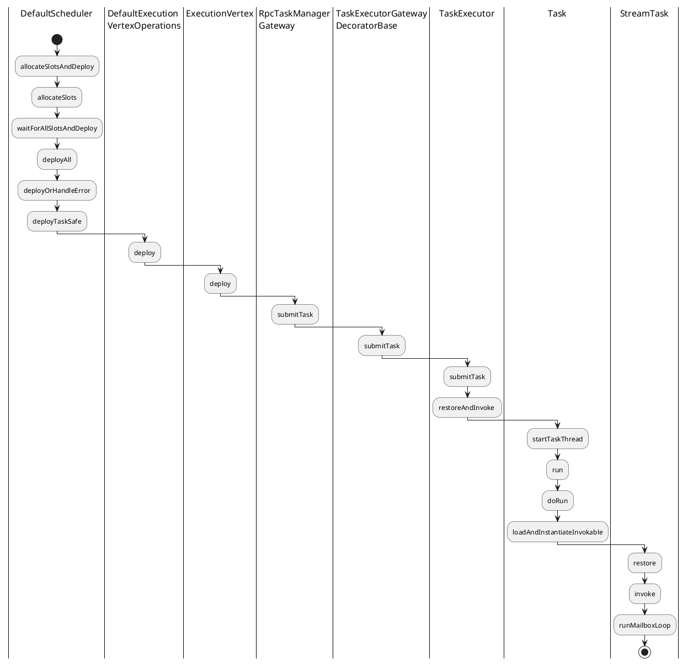

 ### submitTask

```plantuml
@startuml
skinparam swimlane {
  BorderThickness 1
  TitleFontColor black
  TitleFontSize 16

}
|DefaultScheduler|
start
:allocateSlotsAndDeploy;
:allocateSlots;
:waitForAllSlotsAndDeploy;
:deployAll;
:deployOrHandleError;
:deployTaskSafe;

|DefaultExecution\nVertexOperations|
:deploy;
|ExecutionVertex|
:deploy;
|RpcTaskManager\nGateway|
:submitTask;
|TaskExecutorGateway\nDecoratorBase|
:submitTask;
|TaskExecutor|
:submitTask;
:restoreAndInvoke ;
|Task|
:startTaskThread;
:run;
:doRun;
:loadAndInstantiateInvokable;
|StreamTask|
:restore;
:invoke;
:runMailboxLoop;

stop
@enduml
```
