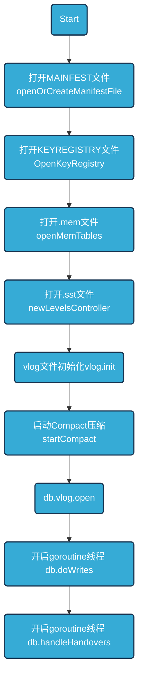

## Badger 

### Db.Open



### 写入流程
1. 把key-vlaue整体append写Vlog
2. value size是否满足阈值valueThreshold,大于阈值,则不吸入value,而是vptr,当然也会把vlog文件偏移位置fid,Offset（vlog.writableLogOffset）写入
3. 否则将key-value整个entry都写入memtable
4. 当memtable size超过一定限制后，将memtable转换为immutable

写vlog
```
// writeRequests is called serially by only one goroutine.
func (db *DB) writeRequests(reqs []*request) error {
	if len(reqs) == 0 {
		return nil
	}

	done := func(err error) {
		for _, r := range reqs {
			r.Err = err
			r.Wg.Done()
		}
	}
	db.opt.Debugf("writeRequests called. Writing to value log")
	//先写vlog,vlog文件fid以及offset
	err := db.vlog.write(reqs)
	if err != nil {
		done(err)
		return err
	}

	db.opt.Debugf("Sending updates to subscribers")
	db.pub.sendUpdates(reqs)
	db.opt.Debugf("Writing to memtable")
	var count int
	for _, b := range reqs {
		if len(b.Entries) == 0 {
			continue
		}
		count += len(b.Entries)
		var i uint64
		var err error
		for err = db.ensureRoomForWrite(); err == errNoRoom; err = db.ensureRoomForWrite() {
			i++
			if i%100 == 0 {
				db.opt.Debugf("Making room for writes")
			}
			// We need to poll a bit because both hasRoomForWrite and the flusher need access to s.imm.
			// When flushChan is full and you are blocked there, and the flusher is trying to update s.imm,
			// you will get a deadlock.
			time.Sleep(10 * time.Millisecond)
		}
		if err != nil {
			done(err)
			return y.Wrap(err, "writeRequests")
		}
		//写LSM
		if err := db.writeToLSM(b); err != nil {
			done(err)
			return y.Wrap(err, "writeRequests")
		}
	}
	done(nil)
	db.opt.Debugf("%d entries written", count)
	return nil
}
```
写LSM
```golang
func (db *DB) writeToLSM(b *request) error {
	db.lock.RLock()
	defer db.lock.RUnlock()
	for i, entry := range b.Entries {
		var err error
		//value是否满足阈值valueThreshold，满足写vptr,不满足直接写kv
		if db.opt.managedTxns || entry.skipVlogAndSetThreshold(db.valueThreshold()) {
			// Will include deletion / tombstone case.
			err = db.mt.Put(entry.Key,
				y.ValueStruct{
					Value: entry.Value,
					// Ensure value pointer flag is removed. Otherwise, the value will fail
					// to be retrieved during iterator prefetch. `bitValuePointer` is only
					// known to be set in write to LSM when the entry is loaded from a backup
					// with lower ValueThreshold and its value was stored in the value log.
					Meta:      entry.meta &^ bitValuePointer,
					UserMeta:  entry.UserMeta,
					ExpiresAt: entry.ExpiresAt,
				})
		} else {
			// Write pointer to Memtable.
			err = db.mt.Put(entry.Key,
				y.ValueStruct{
					Value:     b.Ptrs[i].Encode(),
					Meta:      entry.meta | bitValuePointer,
					UserMeta:  entry.UserMeta,
					ExpiresAt: entry.ExpiresAt,
				})
		}
		if err != nil {
			return y.Wrapf(err, "while writing to memTable")
		}
	}
	if db.opt.SyncWrites {
		return db.mt.SyncWAL()
	}
	return nil
}
```
### 数据读取
1. 数据读取示例
```
err = db.View(func(txn *Txn) error {
	item, err := txn.Get([]byte("key"))
	if err != nil {
		return err
	}

	var valCopy []byte
	item.Value(func(val []byte) error {
		valCopy = append([]byte{}, val...)
		return nil

	})
```
2. 从LSM中查询entry，并不确定是value还是vptr
```
// Get looks for key and returns corresponding Item.
// If key is not found, ErrKeyNotFound is returned.
func (txn *Txn) Get(key []byte) (item *Item, rerr error) {
	if len(key) == 0 {
		return nil, ErrEmptyKey
	} else if txn.discarded {
		return nil, ErrDiscardedTxn
	}

	if err := txn.db.isBanned(key); err != nil {
		return nil, err
	}

	item = new(Item)
	if txn.update {
		if e, has := txn.pendingWrites[string(key)]; has && bytes.Equal(key, e.Key) {
			if isDeletedOrExpired(e.meta, e.ExpiresAt) {
				return nil, ErrKeyNotFound
			}
			// Fulfill from cache.
			item.meta = e.meta
			item.val = e.Value
			item.userMeta = e.UserMeta
			item.key = key
			item.status = prefetched
			item.version = txn.readTs
			item.expiresAt = e.ExpiresAt
			// We probably don't need to set db on item here.
			return item, nil
		}
		// Only track reads if this is update txn. No need to track read if txn serviced it
		// internally.
		txn.addReadKey(key)
	}

	seek := y.KeyWithTs(key, txn.readTs)
	vs, err := txn.db.get(seek)//get操作
	if err != nil {
		return nil, y.Wrapf(err, "DB::Get key: %q", key)
	}
	if vs.Value == nil && vs.Meta == 0 {
		return nil, ErrKeyNotFound
	}
	if isDeletedOrExpired(vs.Meta, vs.ExpiresAt) {
		return nil, ErrKeyNotFound
	}

	item.key = key
	item.version = vs.Version
	item.meta = vs.Meta
	item.userMeta = vs.UserMeta
	item.vptr = y.SafeCopy(item.vptr, vs.Value)
	item.txn = txn
	item.expiresAt = vs.ExpiresAt
	return item, nil
}
```golang
先查询memTable，再查找sst,也就是levelsController
```
func (db *DB) get(key []byte) (y.ValueStruct, error) {
	if db.IsClosed() {
		return y.ValueStruct{}, ErrDBClosed
	}
	//包括memTable(mt,imm)
	tables, decr := db.getMemTables() // Lock should be released.
	defer decr()

	var maxVs y.ValueStruct
	version := y.ParseTs(key)

	y.NumGetsAdd(db.opt.MetricsEnabled, 1)
	for i := 0; i < len(tables); i++ {
		vs := tables[i].sl.Get(key)
		y.NumMemtableGetsAdd(db.opt.MetricsEnabled, 1)
		if vs.Meta == 0 && vs.Value == nil {
			continue
		}
		// Found the required version of the key, return immediately.
		if vs.Version == version {
			return vs, nil
		}
		if maxVs.Version < vs.Version {
			maxVs = vs
		}
	}
	//从sst查找
	return db.lc.get(key, maxVs, 0)
}
```

getMemTables会包含memTable以及imm
```
func (db *DB) getMemTables() ([]*memTable, func()) {
	db.lock.RLock()
	defer db.lock.RUnlock()

	var tables []*memTable

	// Mutable memtable does not exist in read-only mode.
	if !db.opt.ReadOnly {
		// Get mutable memtable.
		tables = append(tables, db.mt)
		db.mt.IncrRef()
	}

	// Get immutable memtables.
	last := len(db.imm) - 1
	for i := range db.imm {
		tables = append(tables, db.imm[last-i])
		db.imm[last-i].IncrRef()
	}
	return tables, func() {
		for _, tbl := range tables {
			tbl.DecrRef()
		}
	}
}
```

遍历memTable 的 Skiplist 
```
// Get gets the value associated with the key. It returns a valid value if it finds equal or earlier
// version of the same key.
func (s *Skiplist) Get(key []byte) y.ValueStruct {
	n, _ := s.findNear(key, false, true) // findGreaterOrEqual.
	if n == nil {
		return y.ValueStruct{}
	}

	nextKey := s.arena.getKey(n.keyOffset, n.keySize)
	if !y.SameKey(key, nextKey) {
		return y.ValueStruct{}
	}

	valOffset, valSize := n.getValueOffset()
	vs := s.arena.getVal(valOffset, valSize)
	vs.Version = y.ParseTs(nextKey)
	return vs
}
```

3.从sst,levelsController查找
```
func (s *levelsController) get(key []byte, maxVs y.ValueStruct, startLevel int) (
	y.ValueStruct, error) {
	if s.kv.IsClosed() {
		return y.ValueStruct{}, ErrDBClosed
	}
	// It's important that we iterate the levels from 0 on upward. The reason is, if we iterated
	// in opposite order, or in parallel (naively calling all the h.RLock() in some order) we could
	// read level L's tables post-compaction and level L+1's tables pre-compaction. (If we do
	// parallelize this, we will need to call the h.RLock() function by increasing order of level
	// number.)
	version := y.ParseTs(key)
	for _, h := range s.levels {
		// Ignore all levels below startLevel. This is useful for GC when L0 is kept in memory.
		if h.level < startLevel {
			continue
		}
		vs, err := h.get(key) // Calls h.RLock() and h.RUnlock().
		if err != nil {
			return y.ValueStruct{}, y.Wrapf(err, "get key: %q", key)
		}
		if vs.Value == nil && vs.Meta == 0 {
			continue
		}
		if vs.Version == version {
			return vs, nil
		}
		if maxVs.Version < vs.Version {
			maxVs = vs
		}
	}
	return maxVs, nil
}
```

以上几步并没有从vlog取value,注意示例里边还有个item.Value()
```
func (item *Item) Value(fn func(val []byte) error) error {
	item.wg.Wait()
	if item.status == prefetched {
		if item.err == nil && fn != nil {
			if err := fn(item.val); err != nil {
				return err
			}
		}
		return item.err
	}
	buf, cb, err := item.yieldItemValue()//从vlog读取value
	defer runCallback(cb)
	if err != nil {
		return err
	}
	if fn != nil {
		return fn(buf)
	}
	return nil
}
func (item *Item) yieldItemValue() ([]byte, func(), error) {
	key := item.Key() // No need to copy.
	if !item.hasValue() {
		return nil, nil, nil
	}

	if item.slice == nil {
		item.slice = new(y.Slice)
	}

	if (item.meta & bitValuePointer) == 0 {
		val := item.slice.Resize(len(item.vptr))
		copy(val, item.vptr)
		return val, nil, nil
	}

	var vp valuePointer
	vp.Decode(item.vptr)
	db := item.txn.db
	result, cb, err := db.vlog.Read(vp, item.slice)//从vlog读取value
	return result, cb, nil
}

```
