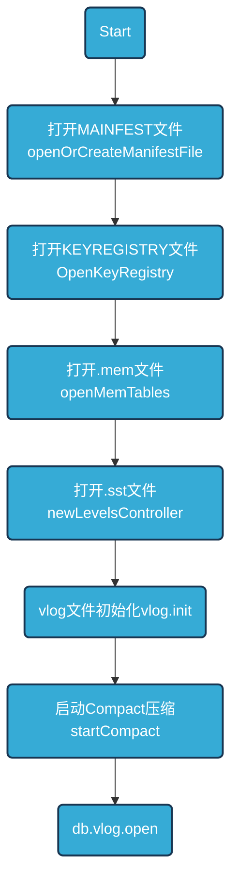

## Badger 

### Db.Open



### 写入流程
1. 把key-vlaue整体append写Vlog
2. value size是否满足阈值valueThreshold,大于阈值,则不吸入value,而是vptr,当然也会把vlog文件偏移位置fid,Offset（vlog.writableLogOffset）写入
3. 否则将key-value整个entry都写入memtable
4. 当memtable size超过一定限制后，将memtable转换为immutable

写vlog
```
// writeRequests is called serially by only one goroutine.
func (db *DB) writeRequests(reqs []*request) error {
	if len(reqs) == 0 {
		return nil
	}

	done := func(err error) {
		for _, r := range reqs {
			r.Err = err
			r.Wg.Done()
		}
	}
	db.opt.Debugf("writeRequests called. Writing to value log")
	//先写vlog,vlog文件fid以及offset
	err := db.vlog.write(reqs)
	if err != nil {
		done(err)
		return err
	}

	db.opt.Debugf("Sending updates to subscribers")
	db.pub.sendUpdates(reqs)
	db.opt.Debugf("Writing to memtable")
	var count int
	for _, b := range reqs {
		if len(b.Entries) == 0 {
			continue
		}
		count += len(b.Entries)
		var i uint64
		var err error
		for err = db.ensureRoomForWrite(); err == errNoRoom; err = db.ensureRoomForWrite() {
			i++
			if i%100 == 0 {
				db.opt.Debugf("Making room for writes")
			}
			// We need to poll a bit because both hasRoomForWrite and the flusher need access to s.imm.
			// When flushChan is full and you are blocked there, and the flusher is trying to update s.imm,
			// you will get a deadlock.
			time.Sleep(10 * time.Millisecond)
		}
		if err != nil {
			done(err)
			return y.Wrap(err, "writeRequests")
		}
		//写LSM
		if err := db.writeToLSM(b); err != nil {
			done(err)
			return y.Wrap(err, "writeRequests")
		}
	}
	done(nil)
	db.opt.Debugf("%d entries written", count)
	return nil
}
```
写LSM
```
func (db *DB) writeToLSM(b *request) error {
	db.lock.RLock()
	defer db.lock.RUnlock()
	for i, entry := range b.Entries {
		var err error
		//value是否满足阈值valueThreshold，满足写vptr,不满足直接写kv
		if db.opt.managedTxns || entry.skipVlogAndSetThreshold(db.valueThreshold()) {
			// Will include deletion / tombstone case.
			err = db.mt.Put(entry.Key,
				y.ValueStruct{
					Value: entry.Value,
					// Ensure value pointer flag is removed. Otherwise, the value will fail
					// to be retrieved during iterator prefetch. `bitValuePointer` is only
					// known to be set in write to LSM when the entry is loaded from a backup
					// with lower ValueThreshold and its value was stored in the value log.
					Meta:      entry.meta &^ bitValuePointer,
					UserMeta:  entry.UserMeta,
					ExpiresAt: entry.ExpiresAt,
				})
		} else {
			// Write pointer to Memtable.
			err = db.mt.Put(entry.Key,
				y.ValueStruct{
					Value:     b.Ptrs[i].Encode(),
					Meta:      entry.meta | bitValuePointer,
					UserMeta:  entry.UserMeta,
					ExpiresAt: entry.ExpiresAt,
				})
		}
		if err != nil {
			return y.Wrapf(err, "while writing to memTable")
		}
	}
	if db.opt.SyncWrites {
		return db.mt.SyncWAL()
	}
	return nil
}
```
