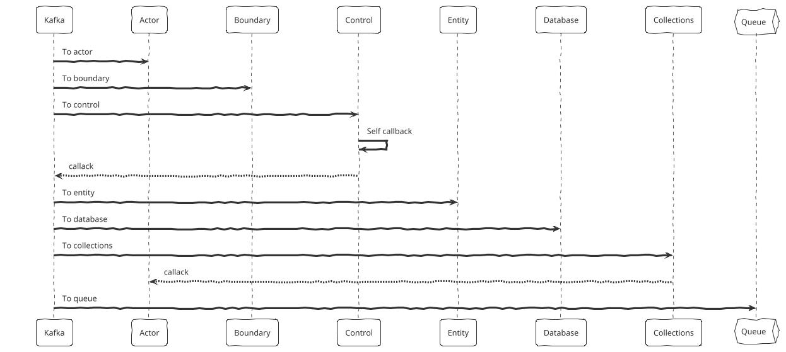
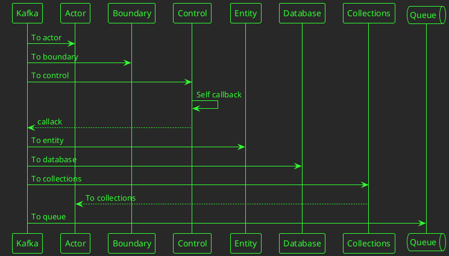
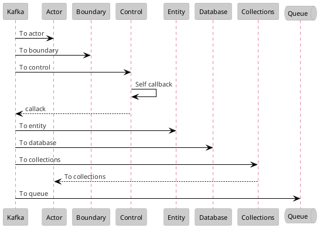
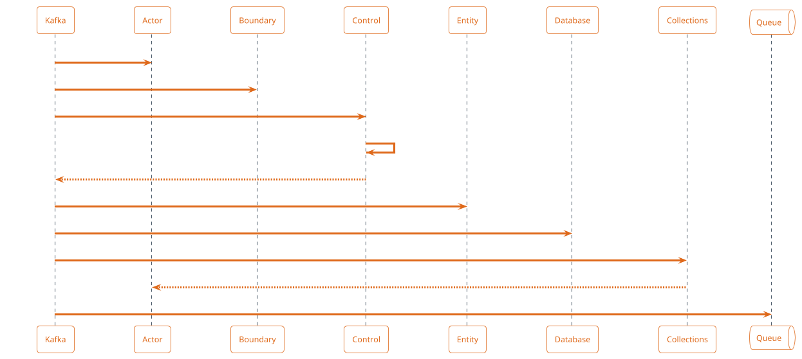
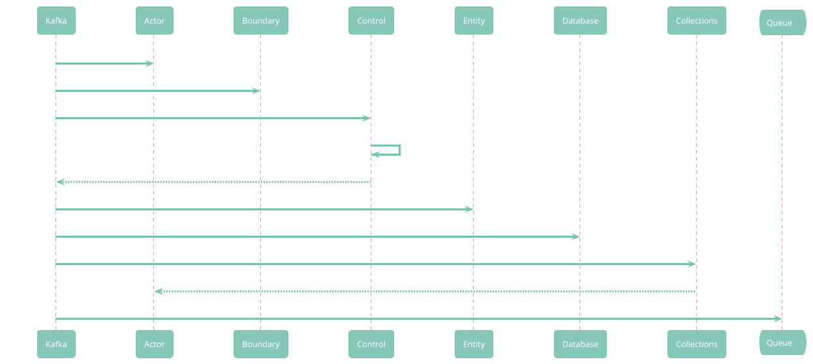
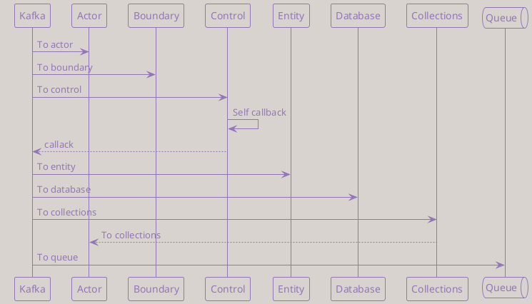
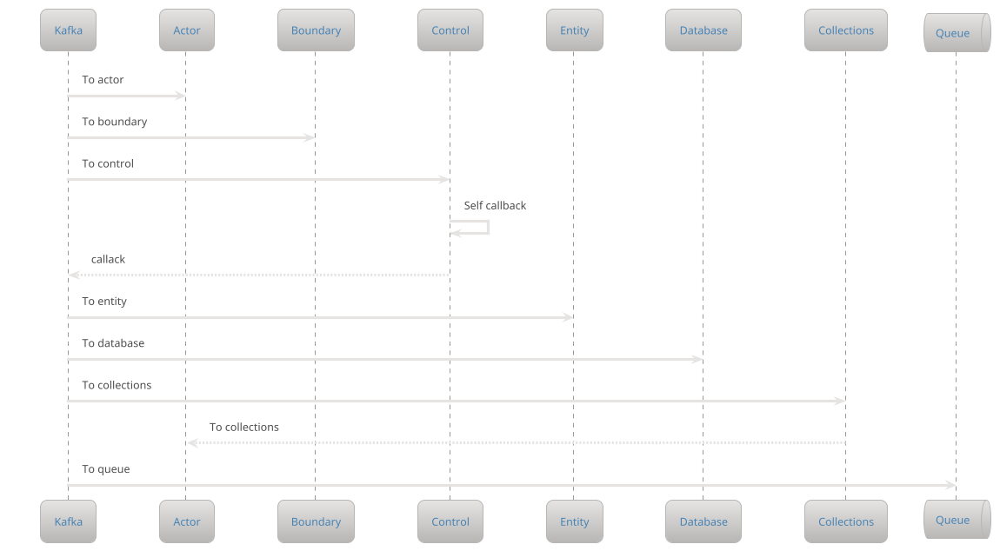
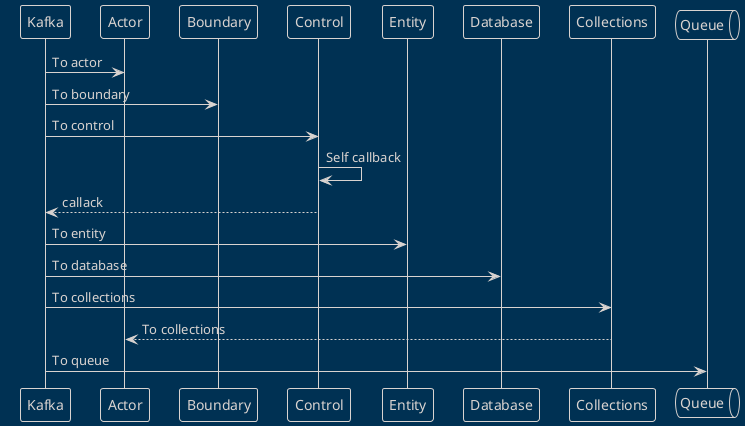
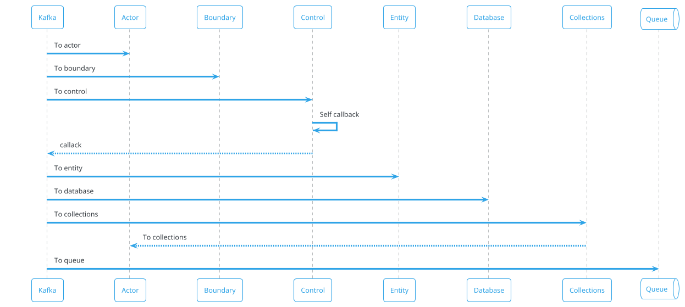
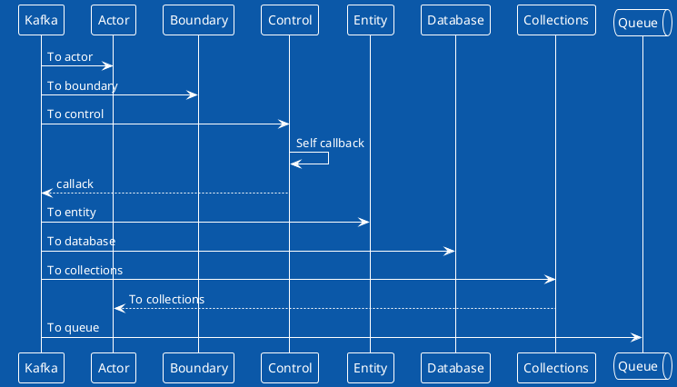

### sketchy-outline

[theme-gallery](http://alphadoc.plantuml.com/doc/markdown/en/theme-gallery#1l61mu8ce6xukt3clixb)

### crt-green

### reddress-lightred

### superhero-outline

### minty

### mimeograph

### metal

### blueprint

### cerulean-outline

### amiga

